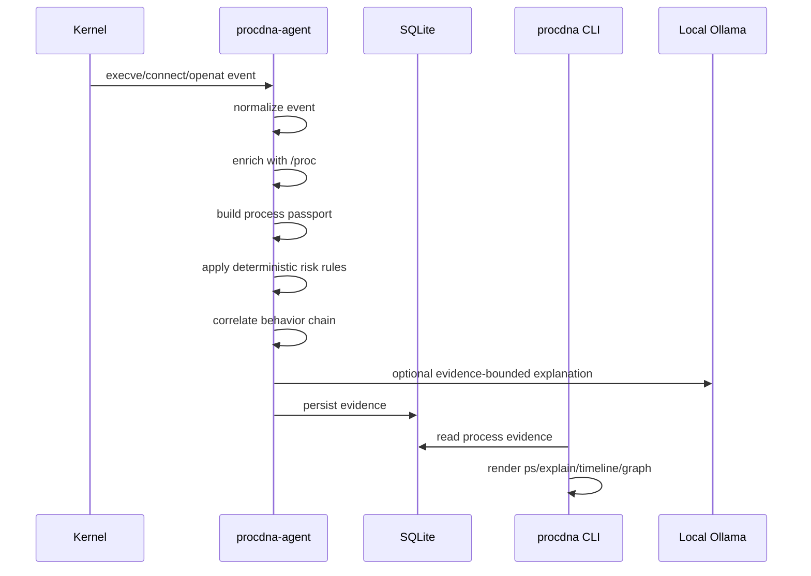
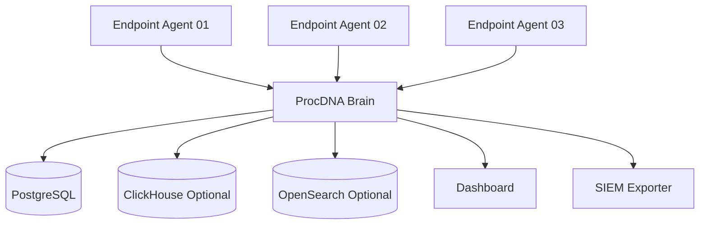

# ProcDNA Architecture

## 1. Architectural Position

ProcDNA is currently a **single-host, local-first Linux process intelligence agent**.

It converts Linux kernel events into a higher-level evidence model.

The current product position is:

```text
Local Linux Process Intelligence Agent
+
Endpoint Evidence Store
+
Forensic CLI
+
AI-assisted explanation layer
```

This is intentionally narrower than a full EDR. The first goal is reliable visibility and explainability.

## 2. Current Deployment Model

```text
Single Linux Host
=================

Kernel
  ├── tracepoint/sys_enter_execve
  ├── tracepoint/sys_enter_connect
  └── tracepoint/sys_enter_openat
          │
          ▼
procdna-agent
  ├── loads eBPF programs
  ├── reads perf/ring events
  ├── builds process passports
  ├── correlates behavior chains
  ├── enriches with /proc
  ├── applies deterministic risk rules
  ├── optionally calls local Ollama
  ├── writes SQLite
  └── writes HTML/JSON reports
          │
          ▼
SQLite local store
  /var/lib/procdna/procdna.db
          │
          ▼
procdna CLI
  ├── ps
  ├── explain
  ├── timeline
  ├── graph
  ├── db
  └── health
```

## 3. Component Responsibilities

### 3.1 procdna-agent

`procdna-agent` is the privileged runtime component.

Responsibilities:

- load eBPF programs
- attach to kernel tracepoints
- collect exec, network, and file events
- normalize raw events
- enrich process information with `/proc`
- build process passports
- apply local risk rules
- correlate behavior chains
- call local LLM when enabled
- write evidence to SQLite
- generate local reports

### 3.2 procdna CLI

`procdna` is the user-facing investigation CLI.

Responsibilities:

- read local SQLite store
- list observed process passports
- explain a process
- show a process timeline
- render a process evidence graph
- manage DB retention/reset/vacuum
- run health checks

### 3.3 SQLite Store

The local SQLite database is the endpoint-local evidence store.

Production location:

```text
/var/lib/procdna/procdna.db
```

Development location:

```text
data/procdna.db
```

The database stores:

- process passports
- network evidence
- file evidence
- behavior chains
- incident report metadata
- schema migration records

### 3.4 Reports

ProcDNA writes local incident reports as:

```text
HTML report: human-readable investigation artifact
JSON report: machine-readable evidence artifact
```

Reports are intentionally separated from DB pruning. A report can be treated as an evidence artifact.

## 4. Current Data Flow



## 5. Architectural Principles

### Evidence-first

Every explanation must be backed by collected process, network, file, or chain evidence.

### AI is advisory

AI explains evidence. It does not make final detection decisions.

### Local-first

The endpoint can collect and investigate data without a central backend.

### Agent and CLI are separate

Privileged event collection and user investigation are separate responsibilities.

### Deterministic risk before ML

Rule-based scoring is preferred before ML-based classification.

## 6. Current Strengths

- Kernel-level event source through eBPF
- Local persistence through SQLite
- Operational CLI
- systemd deployment model
- Evidence graph output
- AI-assisted explanation layer
- DB maintenance commands
- Clear production layout

## 7. Current Limitations

- PID is still used as the primary lookup handle.
- PID reuse can create ambiguity.
- Timestamps are currently coarse compared to nanosecond-level event ordering.
- Behavior chain correlation is simple and UID/time-window based.
- Report-to-chain linkage should be hardened with explicit `chain_id`.
- Schema migrations are still minimal.
- Central multi-host architecture does not exist yet.
- The LLM layer is not strict JSON/evidence contract based yet.

## 8. Future Architecture

The intended future architecture is:

```text
Endpoint Agents
  ├── eBPF collection
  ├── local SQLite buffer
  ├── local risk scoring
  └── secure forwarding

Central Brain
  ├── ingest API
  ├── multi-host correlation
  ├── central storage
  ├── LLM explanation service
  ├── dashboard API
  └── SIEM exporter
```



## 9. Long-Term Product Direction

ProcDNA should evolve into:

```text
AI-native Linux process identity and evidence graph platform
```

The long-term goal is not only to alert on events, but to provide an explainable process identity layer for Linux systems.
