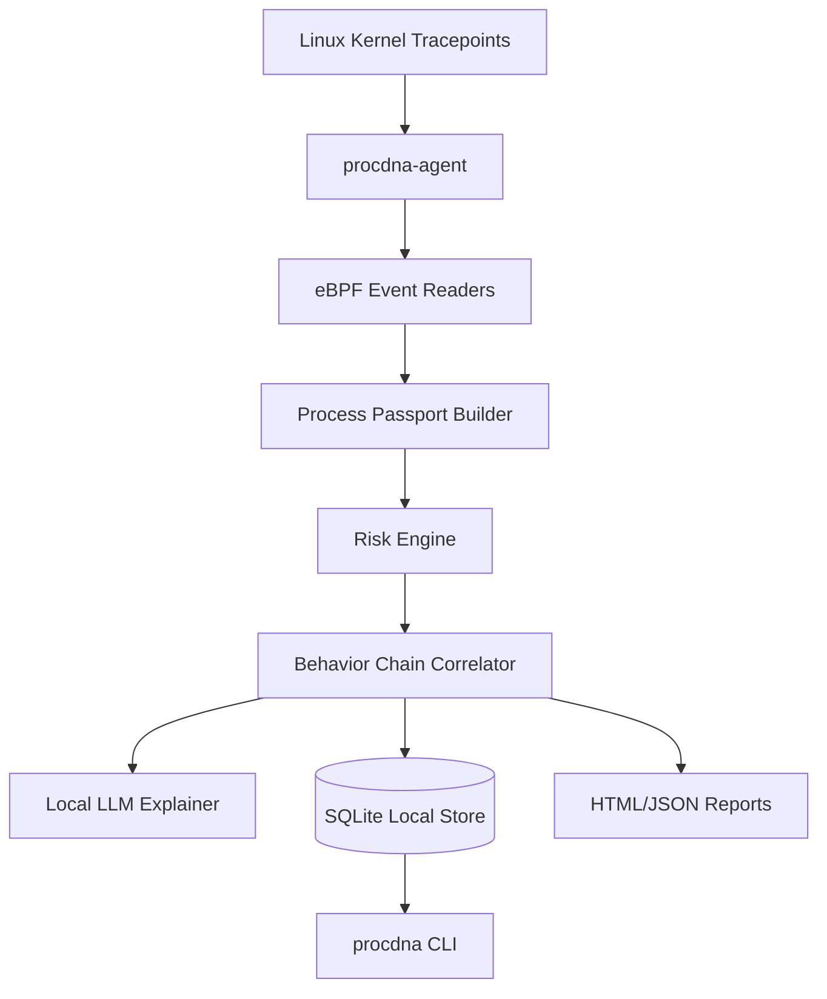

# ProcDNA

**ProcDNA** is a local-first Linux process intelligence prototype that turns raw kernel-level events into explainable process passports, timelines, and evidence graphs.

## Vision

> Every Linux process has a PID. ProcDNA gives it a story.

ProcDNA connects process execution, network behavior, file access, behavior chains, and generated incident reports into a local evidence model.

It is designed around one core idea:

```text
Raw kernel event -> Process passport -> Evidence chain -> Timeline -> Graph -> Explanation
```

## Current Status

ProcDNA is currently a **v0.1 local MVP**.

It can:

- collect `execve`, `connect`, and `openat` events with eBPF
- build process passports
- capture command-line arguments
- enrich processes with parent information
- correlate short-lived behavior chains
- assign deterministic risk scores
- generate local AI-assisted explanations
- persist evidence to SQLite
- generate HTML and JSON incident reports
- run as a systemd service
- expose investigation commands through the `procdna` CLI
- manage local DB retention, reset and vacuum operations
- run basic health checks

## What ProcDNA Is

ProcDNA is best described as:

```text
Local Linux Process Intelligence Agent
+
Endpoint Evidence Store
+
Forensic CLI
+
AI-assisted explanation layer
```

## What ProcDNA Is Not Yet

ProcDNA is not yet:

- a complete EDR
- a prevention system
- a blocking engine
- a central fleet management platform
- a SIEM replacement
- a malware classifier
- an enforcement layer

## Main Commands

```bash
procdna ps
procdna explain <pid>
procdna timeline <pid>
procdna graph <pid>
procdna graph <pid> --format mermaid

procdna db stats
procdna db prune --retention-config --dry-run
procdna db prune --retention-config --yes
procdna db reset --dry-run
procdna db vacuum

procdna health
```

## Current Architecture



## Documentation Sections

- **Architecture**: Current and future component design
- **Data Model**: SQLite schema and future process identity model
- **Operations**: systemd, DB maintenance, health checks
- **Threat Model**: What ProcDNA observes and what it does not prevent
- **Future Hardening**: Security, storage, identity, and LLM hardening
- **Roadmap**: Next engineering stages
- **Development**: Build, run and development workflow
- **Components**: Agent, CLI, eBPF, storage, reports and LLM layer
- **Runbooks**: Practical troubleshooting procedures
- **ADR**: Architecture Decision Records
